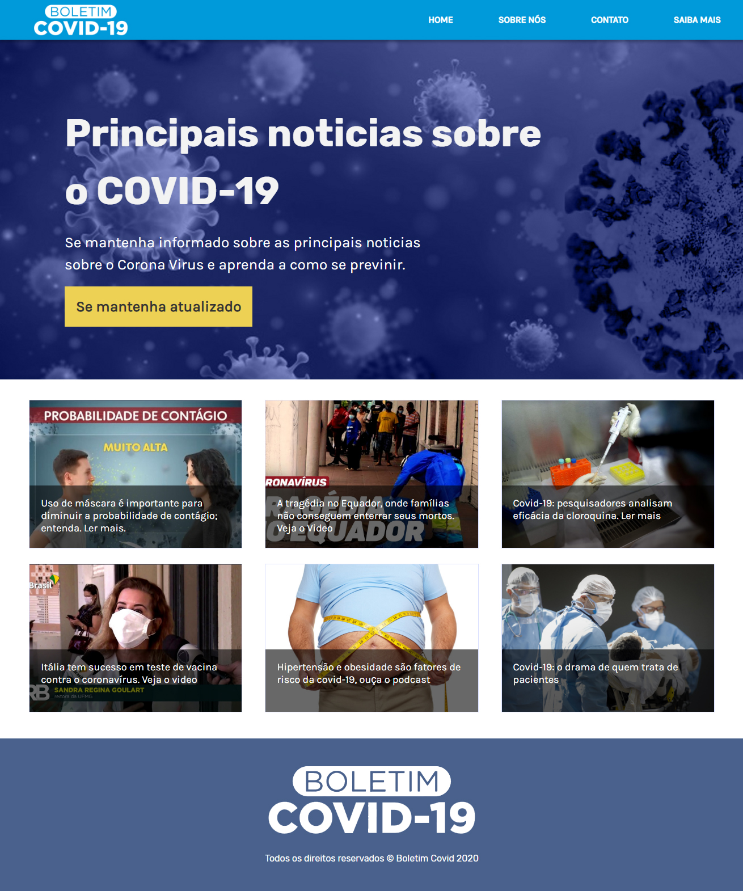

# Boletim - Covid19
> Projeto para um site rapido com pequenas noticias e referencias ao covid-19, feito para o hiring coders

## Histórico de lançamentos

* 0.0.1
    * ADD: Inclusão do menu topo
    * ADD: Inclusão do banner
    * ADD: Inclusao do texto
    * ADD: Estruturação do grid
    * ADD: Footer
    * UPDATE: Responsividade do Menu Topo
    * UPDATE: Estilização da estrutura feita
* 0.0.8
    * Update: Menu responsivo, correção do logo e ajuste de espaçamento no mobile
    * Info: Falta teste de usabilidade
    * Update: Banner, troca de texto e ajuste do botão.
    * Update: Padronizando colunas da noticia com flex.
    * ADD: Primeiro modelo de caixa de noticias
    * Update: Ajustes de posição de caixa de texto e imagem de fundo
    * ADD: Primeira pagina de noticia em branco 
* 0.1.5
    * ADD: Imagens, videos e audios referente a noticias
    * UPDATE: Corrigindo layout das noticias
    * ADD: Codigo referente a pagina noticia / video / audio
* 0.1.8
    * ADD: Pagina Sobre
    * UPDATE: Configurando estilo da pagina e posição do grid 
* 0.2.0
    * ADD: Pagina Saiba Mais & Contato
    * Update: Estilização das duas paginas
* 0.2.3
    * Info: Versão final e envio para o servidor
    
## Envolvidos no desenvolvimento

Jorge Henrique – [@LinkedIn](https://www.linkedin.com/in/jorge-henrique-baptista/) – jorgehenrique@live.com

The MIT License (MIT)

Copyright (c) 2020 covid19boletim
